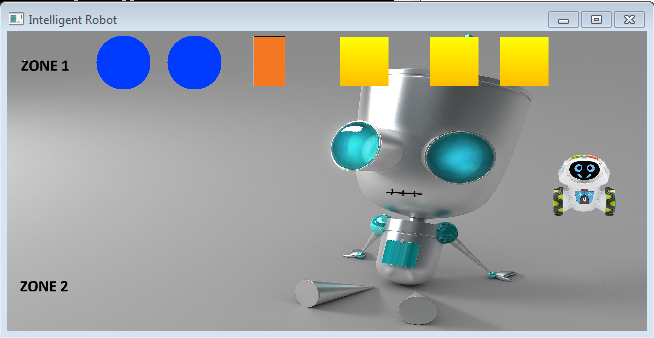

# RobotGame_SDL2
A simple 2D game implemented in C using SDL2.x graphic library. This is just a toy project to play with and learn SDL 2.x.

# Previews

# Usage
 - Press UP, DOWN, LEFT, RIGHT to move the robot
 - Touch a Circle so the robot can move it to ZONE 2
 - Press D to draw a lign while the robot is moving
 - Repress D to delete the drawning
 - Press Esc to end the game, then Y to Replay or any other button to exit.
 
# Build
Note1: The SDL2 files included with the project are for x86-64 architecture.

To build the executable (.exe) from the source files on Windows :

1/ Open Windows Command Prompt (CMD.exe) or PowerShell,

2/ Make sure you have the "make" package installed on your computer by trying the command "mingw32-make" or "make"

3/ Change command directory to the project's folder using "cd" command

4/ Run the one of the following commands: "mingw32-make --f Makefile.make" or "make --f Makefile.make"
